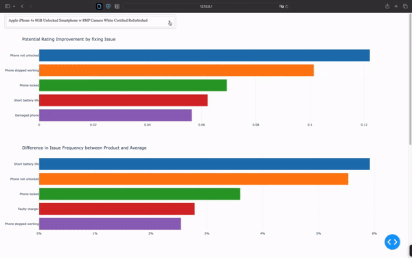
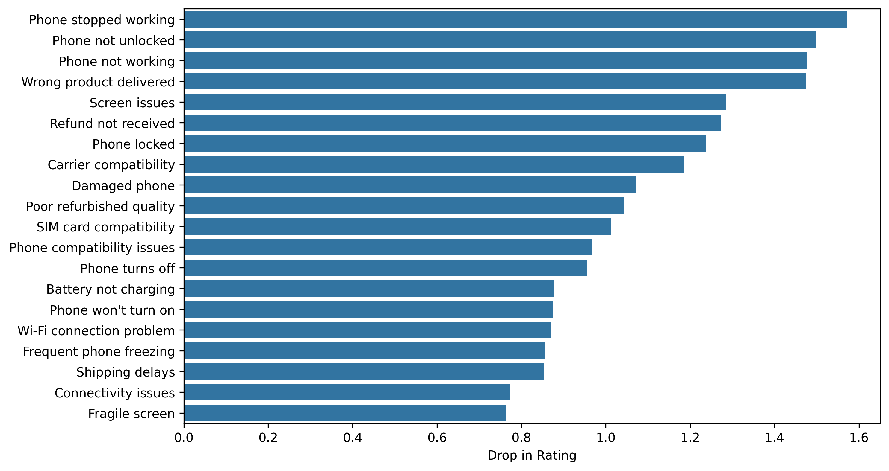

# Amazon Reviews

This repository contains the code for a project completed during the 24-hour [Lauzhack 2023](https://lauzhack-2023.devpost.com), which I worked on together with [Lennard Schaub](https://github.com/try1233). We chose to take on Amazon's challenge: analyzing a dataset of phone reviews to provide valuable insights for vendors selling these phones. We updated the code after the hackathon to make use of new LLM-models and techniques.

This was my first hackathon, and it was a truly great experience. We even made it to the final round of the overall competition and, in a completely sleep-deprived state, had the honor of presenting in front of a large lecture hall filled with other participants.

## Solution Overview

We believe the greatest value in customer reviews lies in their ability to reveal a product’s weaknesses. Addressing these weaknesses is essential in the highly competitive online marketplace, where reviews and ratings significantly influence users’ purchasing decisions. As a result, sellers have a strong interest in identifying the most pressing issues to prioritize product improvements and gain a competitive edge.

Our solution offers a framework for extracting these insights from unstructured review text, coupled with a simple interactive visualization tool to make them accessible. While our focus was on a phone review dataset, the approach can easily be adapted to other domains of reviews with minimal to no changes.



### Issue Mining

The reviews are unstructured text, containing possibly multiple issues all at once. Further since they are from different users the language also differs amongst them, some users write very objective reviews while others get very emotional up until having insult in their reviews. Not the perfect foundation for a rational analysis. To tackle the problem we use GPT-4o-mini with json mode to extract a list of issues of one review and to rewrite them in a neutral way. We use Open AIs batch mode to reduce the cost for this operation (for the 50.000 reviews we considered the cost was only 1$).

### Issue Clustering

Now, we have a dataset filled with issues, each described in a single sentence. While this is a step in the right direction, there are still thousands of extracted issues, making analysis challenging. However, many of these issues are quite similar (e.g., “Phone has bad battery life” and “Battery dies after only 2 hours”). To address this, we can group similar issues into clusters.

To achieve this, we use the OpenAI embedding API to embed each issue as a 256-dimensional vector representing the essence of the text. To visualize these high-dimensional embeddings, we apply t-SNE to reduce them to two dimensions. We then perform cluster analysis on these reduced embeddings using the BIRCH algorithm, resulting in 50 clusters numbered from 1 to 50.

To make these clusters easier for our users to understand, we use GPT-4 to generate descriptive names for each cluster based on representative examples. Ideally, each cluster would correspond to a specific issue the product (in our case, a phone) might have — for example, a cluster containing all issues related to poor battery life.

### Data Analysis

For each review, we now have a list of identified issues. With this information, we can perform several interesting analyses.

First, we fit a linear model to predict the star rating based solely on the product and the issues mentioned in the review. By examining the coefficients of the fitted model, we can gauge the severity of different issues. The most severe issues are plotted below. As expected, issues like "Phone stopped working" have a significant negative impact on the rating.



Using this model, we can answer an important question: "How much would my overall rating improve if I fixed a specific issue?" To answer this, we first use the model to predict the rating for all reviews of a particular product. Then, we modify the data by removing the issue in question (assuming it has been fully resolved) and predict the ratings again. The difference between the average ratings of both predictions provides an estimate of how much the rating would improve if that issue were eliminated.

Another valuable analysis is examining the frequency of certain issues for a specific product. We can compare how often an issue occurs for a particular product against its occurrence across all products. This comparison can reveal specific weaknesses of our product relative to the competition.

### User Interface

Ultimately, no matter how valuable our insights are, they might be worthless if they aren’t accessible to potential users. To address this, we developed an interactive Plotly Dash application to showcase our results. This application allows users to select a product and view the outcomes of the two analyses mentioned above.

Additionally, we visualize all issues related to a given product using the two-dimensional embeddings we created. In this plot, similar issues are positioned close to each other, and users can view the issue texts by hovering over the points. The application also provides a lasso tool, enabling users to select a subset of issues. Once selected, the corresponding full reviews, along with their ratings, are displayed in a table below, allowing users to explore the issues in greater depth and gain a better understanding.

## Code

Follow these instructions to set up your environment and run the analysis on your own.

### 1. **Clone the Repository**

If you haven't already, clone the repository and navigate into the project directory:

```bash
git clone https://github.com/nifleisch/lauzhack-amazon-reviews.git
cd lauzhack-amazon-reviews
```

### 2. **Create a Virtual Environment**

In the root directory of the project, create a virtual environment named `venv`:

```bash
python -m venv venv
```

> **Note**: Use `python3` instead of `python` if required by your system.

### 3. **Activate the Virtual Environment**

Activate the virtual environment using the following commands:

- **Windows**:

  ```bash
  venv\Scripts\activate
  ```

- **macOS/Linux**:

  ```bash
  source venv/bin/activate
  ```

### 4. **Install Required Packages**

With the virtual environment activated, install all the dependencies from the `requirements.txt` file:

```bash
pip install -r requirements.txt
```

### 5. **Download the Dataset**

Download the dataset from [Kaggle](https://www.kaggle.com/datasets/PromptCloudHQ/amazon-reviews-unlocked-mobile-phones). You may need to create a Kaggle account if you don't already have one. Place the downloaded dataset in the `data` folder of the project.

### 6. **Subset the Dataset**

To reduce costs and avoid exceeding OpenAI's usage limitations, we will only consider a subset of the 100 products with the most reviews and include reviews that consist of more than 40 characters. Run the following script:

```bash
python 01_subset_dataset.py
```

### 7. **Extract Issues**

To extract issues from the reviews, you'll need to make a call to the OpenAI API. First, create a `.env` file in the project root with your OpenAI API key:

```plaintext
OPENAI_API_KEY=your_openai_api_key_here
```

Then, run the following script:

```bash
python 02_issue_extraction.py
```

### 8. **Create the Issue Dataset**

Wait for the batch job to finish on the OpenAI dashboard, which may take a few hours (around 4 hours on average). Once complete, download the result from the dashboard and rename the file to `batch_output.jsonl`. Then run:

```bash
python 03_issue_dataset.py
```

### 9. **Perform Issue Clustering**

Cluster the extracted issues by running the following two scripts in order:

```bash
python 04_embedding.py
```

```bash
python 05_clustering.py
```

### 10. **Analyze the Data**

Analyze the data and create the result dataframes with:

```bash
python 06_data_analysis.py
```

### 11. **Run the Dash Application**

Now that all files are ready, run the Plotly Dash application. The terminal will display an address that you can open in your browser to interact with the application:

```bash
python app.py
```
